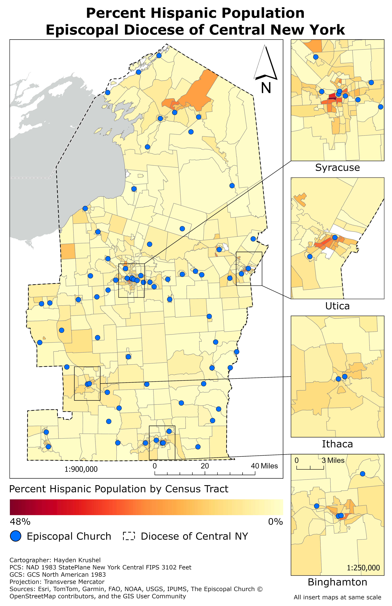

Nestled deep among glacial valleys and small farms, the Episcopal Diocese of Central New York serves over 8,500 baptized members across 74 active congregations (https://cnyepiscopal.org/welcome/#who-we-are). Since 2023 I've been one of these members, attending services at my university's chaplaincy during the school year. In 2025 I was honored to attend my diocese's annual convention, where I was shocked to find demographics very different than that of my own parish. Most in attendance were seniors and overwhelmingly white. I gave more thought to my reaction, and realized that I knew very little about my diocese and the people who compose it. This exploration then is an attempt to better understand the people and the land of my diocese.

# Landscape
To understand the Church today, it is wise to look into its history. The Episcopal Church is a member of the world-wide Anglican Communion...

```{python}
#| fig-cap: "Interactive Map of Churches in the Diocese of Central New York"

import leafmap
from ipyleaflet import basemaps, basemap_to_tiles, FullScreenControl

churches = "data/cny_churches_2026.geojson"
borders = "data/cny_diocese_borders.geojson"

satellite = basemap_to_tiles(basemaps.Esri.WorldImagery)
satellite.name = "Satellite"
satellite.base = True

topo = basemap_to_tiles(basemaps.OpenTopoMap)
topo.name = "Topographic"
topo.base = True

map = leafmap.Map(
  center=[43.2, -76.0],
  zoom=8,
  min_zoom=7,
  draw_control=False,
  toolbar_control=False,
  fullscreen_control=False,
  height="700px",
  width="600px",
)

map.add_layer(satellite)
map.add_layer(topo)

map.add_layer_control(position="topright")

map.add_control(FullScreenControl(position="topright"))

map.add_circle_markers_from_xy(
  churches,
  x="longitude",
  y="latitude",
  layer_name="Episcopal Churches",
  popup=["Name", "Address", "Website"],
  radius=6,
  color="black",
  weight=2,
  fill_color="#0070FF",
  fill_opacity=1.0
)

style = {
  "color": "#FF0000",
  "weight": 2,
  "fillColor": "#FF0000",
  "fillOpacity": 0
}

hover_style = {
  "color": "#FF0000",
  "weight": 2,
  "fillColor": "#FF0000",
  "fillOpacity": 0
}

map.add_vector(
  borders,
  layer_name="Diocesan Borders",
  style=style,
  hover_style=hover_style,
  info_mode=None
)

map
```

# Race and Ethnicity

::: {.column-page layout-ncol="5"}
{width=450}

{width=450}

{width=450}

{width=450}

{width=450}

:::

# Age
::: {.column-page layout-ncol="5"}
{width=450}

{width=450}

{width=450}

{width=450}

{width=450}
:::
# Economic Status
::: {.column-page layout-ncol="3"}

{width=325}

{width=325}

{width=325}

:::
# Nativity
::: {.layout-ncol="3"}

{width=325}

:::

# Educational Attainment

::: {.column-page layout-ncol="3"}

{width=325}

{width=325}

{width=325}

:::
